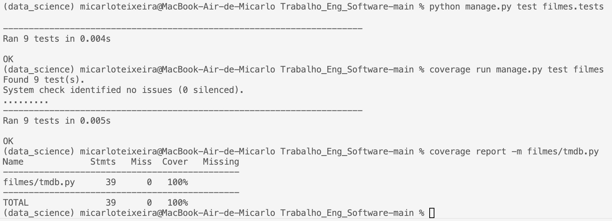

# Registro do teste do módulo TMDb

Este documento descreve o teste unitário criado para o módulo `filmes/tmdb.py`, responsável por encapsular todas as chamadas à API do TMDB dentro do MVP. O objetivo foi garantirvque cada função desse módulo mantém a URL, os parâmetros e o tratamento de erros esperados.

## Escopo avaliado
O caso de teste `TMDBApiTest` definido em `filmes/tests.py` cobre os seguintes cenários:
- Validação da função `get_headers`, tanto quando há um token configurado quanto para o fluxo que deve gerar `RuntimeError` na ausência do token.
- Invocação correta das funções `search_movie`, `movie_details`, `movie_credits`, `watch_providers`, `trending_movies` e `now_playing_movies`, verificando URL final, parâmetros enviados e propagação das respostas simuladas.
- Propagação de exceções HTTP quando `requests.raise_for_status()` encontra erros (ex.: retorno 404).

Cada chamada externa é isolada com `unittest.mock.patch`, o que evita dependência da API real e permite validar apenas a lógica que pertence ao nosso código.

## Como executar
1. Criar/ativar um ambiente virtual: `python -m venv .venv && source .venv/bin/activate`.
2. Instalar as dependências.
3. Rodar os testes do app: `python manage.py test filmes`.
4. Gerar os dados de cobertura: `coverage run manage.py test filmes`.
5. Emitir o relatório: `coverage report -m filmes/tmdb.py`.

## Resultado obtido
A saída abaixo (terminal) mostra a execução dos testes e o relatório de cobertura associado.



```
Name             Stmts   Miss  Cover   Missing
----------------------------------------------
filmes/tmdb.py      39      0   100%
----------------------------------------------
TOTAL               39      0   100%
```

Os 39 statements do módulo foram exercitados, garantindo cobertura total.
